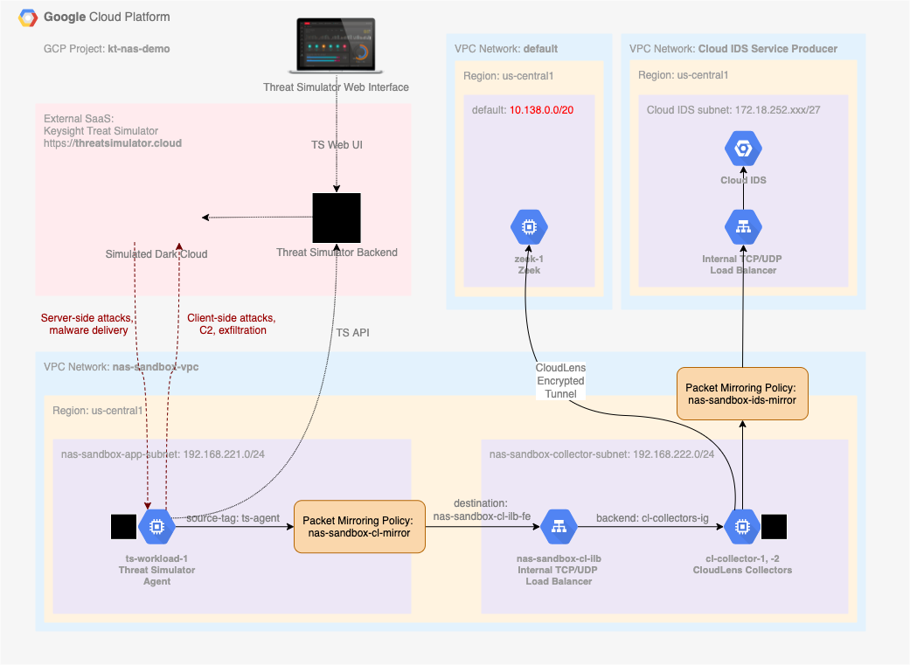

# Keysight CloudLens sandbox on Google Cloud with Cloud IDS and 3rd party sensor

## Overview

This sandbox is targeting traffic monitoring scenario in Google Cloud with a combination of native Cloud IDS service and a 3rd party network traffic sensor. At the moment of writing, Google Cloud IDS does not support its simulteneous use with 3rd party sensors. There are cases, when Google Cloud customers have a need to use a 3rd party sensor, for example, Zeek network traffic analyzer, to enable threat hunting efforts, or any other reason. At the same time, they might find ease of use provided by Cloud IDS, appealing to enable network threat detection. Although such cases are not supported by Cloud IDS yet, it becomes possible to implement them via Keysight CloudLens - a distributed cloud packet broker. As with physical network packet brokers, CloudLens is capable of aggregating monitored cloud traffic via its collectors, and then feeding it to both 3rd party tools like Zeek, as well as Cloud IDS, for analysis and detection.

The goals of the sandbox are:

* Validate compatibility of CloudLens operational model with Cloud IDS.
* Provide a blueprint for CloudLens deployment in Google Cloud to feed multiple network analysis tools.

## Diagram



## Adopting command syntax to your environment

1. Throughout the document, a GCP Project ID parameter `--project=kt-nas-demo` is used for `gcloud` command syntax. Please change `kt-nas-demo` to specify a GCP Project ID you intend to use for the deployment
2. Where applicable, GCP Region `us-central1` and/or Zone `us-central1-a` are used withing the document. Consider changing to a region and zone that fit your deployment via `--region=us-central1` and `--zone=us-central1-a` parameters.

## Google Cloud VPC Configuration

1. Create a NAS Sandbox VPC for Threat Simulator agent and CloudLens Collector deployment. If needed, change IP address ranges to fit your design.

| Parameter 						| Value
| --- 									| ---
| Name 									| `nas-sandbox-vpc`
| Description 					| Keysight NAS Sandbox
| Subnets 							| custom
| &nbsp;&nbsp;&nbsp;&nbsp;Name 								| `nas-sandbox-app-subnet`
| &nbsp;&nbsp;&nbsp;&nbsp;Region 							| us-central1
| &nbsp;&nbsp;&nbsp;&nbsp;&nbsp;&nbsp;&nbsp;&nbsp;IP address range 	| `192.168.221.0/24`
| &nbsp;&nbsp;&nbsp;&nbsp;Name 								| `nas-sandbox-collector-subnet`
| &nbsp;&nbsp;&nbsp;&nbsp;Region 							| us-central1
| &nbsp;&nbsp;&nbsp;&nbsp;&nbsp;&nbsp;&nbsp;&nbsp;IP address range 	| `192.168.222.0/24`

```Shell
gcloud compute networks create nas-sandbox-vpc --project=kt-nas-demo --description="Keysight NAS Sandbox" --subnet-mode=custom --mtu=1460 --bgp-routing-mode=regional
gcloud compute networks subnets create nas-sandbox-app-subnet --project=kt-nas-demo --range=192.168.221.0/24 --network=nas-sandbox-vpc --region=us-central1
gcloud compute networks subnets create nas-sandbox-collector-subnet --project=kt-nas-demo --range=192.168.222.0/24 --network=nas-sandbox-vpc --region=us-central1
```

Cloud IDS service operates via [Private Service Access](https://cloud.google.com/vpc/docs/configure-private-services-access) network connectivity. To start using Cloud IDS, you must enable Private Services Access and allocate an IP address range for private connectivity with Cloud IDS Service Producer. From GCP documentation: "When you create an IDS endpoint, a subnet with a 27-bit mask is allocated from your Private Service Access allocated IP address ranges. The allocated subnet contains an internal load-balancer. Any traffic mirrored or directed to this load-balancer will be inspected by the IDS endpoint."

2. Activate the Service Networking API in your project. The API is required to create a private connection.

```Shell
gcloud services enable servicenetworking.googleapis.com --project=kt-nas-demo
```

3. Allocate an IP range for Google-produced Private Services

```Shell
gcloud compute addresses create google-managed-services-nas-sandbox-vpc \
    --global \
    --purpose=VPC_PEERING \
    --addresses=172.18.248.0 \
    --prefix-length=22 \
    --description="Peering range for Google Managed Services" \
    --network=nas-sandbox-vpc \
    --project=kt-nas-demo
```

You can check IP ranges currently allocated using

```Shell
gcloud compute addresses list --global --filter="purpose=VPC_PEERING AND network=nas-sandbox-vpc"
```

4. Now create a private connection using the IP range

```Shell
gcloud services vpc-peerings connect \
    --service=servicenetworking.googleapis.com \
    --ranges=google-managed-services-nas-sandbox-vpc \
    --network=nas-sandbox-vpc \
    --project=kt-nas-demo
```

To check if the operation was successful list existing connections

```Shell
gcloud services vpc-peerings list \
    --network=nas-sandbox-vpc \
    --project=kt-nas-demo
```

5. Create VPC Firewall rules in `nas-sandbox-vpc` to permit HTTP and HTTPS traffic to any target tagged as `http-server` and `https-server`

```Shell
gcloud compute --project=kt-nas-demo firewall-rules create nas-sandbox-allow-http --description="Allow http ingress to any instance tagged as http-server" --direction=INGRESS --priority=1000 --network=nas-sandbox-vpc --action=ALLOW --rules=tcp:80 --source-ranges=0.0.0.0/0 --target-tags=http-server
gcloud compute --project=kt-nas-demo firewall-rules create nas-sandbox-allow-https --description="Allow https ingress to any instance tagged as https-server" --direction=INGRESS --priority=1000 --network=nas-sandbox-vpc --action=ALLOW --rules=tcp:443 --source-ranges=0.0.0.0/0 --target-tags=https-server
```

6. (Optional) Permit SSH access to GCP instances via a browser. See [https://cloud.google.com/iap/docs/using-tcp-forwarding](https://cloud.google.com/iap/docs/using-tcp-forwarding) for more information.

```Shell
gcloud compute --project=kt-nas-demo firewall-rules create allow-ssh-from-browser-nas-sandbox-vpc --description="https://cloud.google.com/iap/docs/using-tcp-forwarding" --direction=INGRESS --priority=1000 --network=nas-sandbox-vpc --action=ALLOW --rules=tcp:22 --source-ranges=35.235.240.0/20
```


## Threat Simulator Workload Deployment

1. If you do not have an active Threat Simulator account, request evaluation access at [https://threatsimulator.cloud/login](https://threatsimulator.cloud/login)
2. Once the eval is approved, login to [Theat Simulator console](https://threatsimulator.cloud/login), navigate to Deployment page, and open "Anywhere" for a deployment type
3. Scroll down to AGENT INSTALLATION to a CURL command line, which looks similar to the following. In your case, there will be a different `OrganizationID`. Agent version would vary with time as well.

```Shell
curl "https://api.threatsimulator.cloud/agent/download?OrganizationID=1234567890abcdef1234567890abcdef&Type=onpremise-linux" > agent-21.3.0.2325.run
```

4. Copy the 32-character value of `OrganizationID` string from the line above and paste it to the script below on the line `organizationID` right after the `=` sign. Deploy a Threat Simulator Agent instance on GCP by running the following command in GCP Console.

[//]: # (TODO consider making the name of the agent to reflect the instance name.)  

```Shell
gcloud compute instances create ts-workload-cl-1 \
--zone=us-central1-a \
--machine-type=e2-small \
--subnet=nas-sandbox-app-subnet \
--image-family=ubuntu-2004-lts \
--image-project=ubuntu-os-cloud \
--boot-disk-size=10GB \
--boot-disk-device-name=ts-workload-cl-1 \
--tags=ts-agent,http-server,https-server \
--metadata=startup-script='#!/bin/bash -xe
if [ ! -f /home/threatsim/.tsinstalled ]; then
	sysctl -w net.ipv6.conf.all.disable_ipv6=1
	sysctl -w net.ipv6.conf.default.disable_ipv6=1
	apt update
	apt -y install docker.io
	systemctl restart docker
	systemctl enable docker
	useradd -m -G google-sudoers threatsim
	organizationID="1234567890abcdef1234567890abcdef"
	name="NAS-Sandbox-CloudLens-1"
	APIbaseURL="https://api.threatsimulator.cloud"
	curl $APIbaseURL/agent/download\?OrganizationID\=${organizationID}\&Type\=onpremise-linux >/home/threatsim/agent-init.run
	chown threatsim:threatsim /home/threatsim/agent-init.run
	sudo -u threatsim /bin/bash /home/threatsim/agent-init.run --quiet -- -y -n "${name}"
	if [ `docker ps -qf name=ts-filebeat | wc -l` -ge 1 ]; then touch /home/threatsim/.tsinstalled; fi
fi'
```

5. After about 5 minutes the Threat Simulator workload should appear in Threat Simulator UI under [Agents](https://threatsimulator.cloud/security/agent) section

## CloudLens Manager Deployment

[//]: # (commented out Follow steps from [CloudLens Manager deployment section](https://github.com/OpenIxia/gcp-cloudlens/blob/main/DEPLOY.md#deploying-cloudlens-manager) applicable to Google Cloud.)

1. Deploy an Ubuntu instance for CloudLens Manager in a default VPC

[//]: # (TODO static public IP address)

```Shell
gcloud compute instances create cl-manager-usc1-1 \
--zone=us-central1-a \
--machine-type=e2-standard-4 \
--subnet=default \
--image-family=ubuntu-1804-lts \
--image-project=ubuntu-os-cloud \
--boot-disk-size=100GB \
--boot-disk-device-name=cl-manager-usc1-1 \
--tags=cl-manager,https-server
```

2. Copy Cloudlens Manager universal installer script to the instance. You can download CloudLens Manager from [Ixia/Keysight support website](https://support.ixiacom.com/support-overview/product-support/downloads-updates/versions/228985)

[//]: # (TODO need unauthenticated access for this cookbook to be of any value)


```Shell
gcloud compute scp CloudLens-Installer-6.0.2-4.sh cl-manager-usc1-1:
````

3. Connect to the instance via SSH and install CloudLens Manager

[//]: # (TODO need a way to run this in batch mode, preferably from user-data startup script. Currently, the error pops "tput: No value for $TERM and no -T specified")

```Shell
gcloud compute ssh cl-manager-usc1-1
bash CloudLens-Installer-6.0.2-4.sh
````

4. Record a public IP of the CloudLens Manager instance, which would be refered as `clm_public_ip` further in this document

```Shell
export clm_public_ip=`gcloud compute instances describe cl-manager-usc1-1 --format='get(networkInterfaces[0].accessConfigs[0].natIP)'`; echo $clm_public_ip
````

5. (Optional) Create a DNS entry for `clm_public_ip`. Here we're using `gcp-clm-usc.ixlab.org` hosted on AWS Route 53. Once we have a DNS entry, create a TLS certificate the DNS record.

```Shell
export AWS_CONFIG_FILE=$HOME/certbot/etc/route53.cfg
certbot --config-dir ~/certbot/etc --work-dir ~/certbot/var --logs-dir ~/certbot/log   certonly --dns-route53 -d gcp-clm-usc.ixlab.org
````

4. To access CloudLens Manager, open a web browser and enter `https://clm_public_ip` in the URL field. It may take up some time for CloudLens Manager Web UI to initialize

The default credentials for the CloudLens admin account are as follows. After first login you will be asked to change the password.

  * Username admin
  * Password Cl0udLens@dm!n

5. In CloudLens Manager admin UI, section "Remote Access URL", change private IP address to `clm_public_ip` or corresponding DNS entry. If you created a TLS cerficicate, upload it via "Import TLS Certificate" section. Use `fullchain1.pem` certificate, if you created it with certbot (Let's Encrypt).

6. Logout from admin session and choose "Create User" with parameters of your liking. Login with identity of the newly created user.

7. Add CloudLens license via "Settings > Account Management"
[//]: # (TODO we need a self-served trial capabilities here, probably enabled by default - see Splunk eval model)

8. Choose "I already have a project", and then create a project by clicking ‘+’. Use any project name you see fit. Open the project. Click "SHOW PROJECT KEY" and copy the key.

## CloudLens Collector Deployment

9. Deploy a pair of Ubuntu instance as CloudLens Collectors in a `nas-sandbox-vpc`. We are going to use these instances to collect network traffic using Packet Mirroring service from the Threat Simulator instance. In `--metadata` section in each, replace `cloudlens_project_key` with the project key that was copied in the previous step. Replace `clm_public_ip` as well, there are three occurances in each block.

```Shell
gcloud compute instances create cl-collector-usc1-sandbox-1 \
--zone=us-central1-a \
--machine-type=e2-medium \
--subnet=nas-sandbox-collector-subnet \
--image-family=ubuntu-1804-lts \
--image-project=ubuntu-os-cloud \
--boot-disk-size=10GB \
--boot-disk-device-name=cl-collector-usc1-sandbox-1 \
--tags=cl-collector \
--scopes=https://www.googleapis.com/auth/compute.readonly,https://www.googleapis.com/auth/servicecontrol,https://www.googleapis.com/auth/service.management.readonly,https://www.googleapis.com/auth/logging.write,https://www.googleapis.com/auth/monitoring.write,https://www.googleapis.com/auth/trace.append,https://www.googleapis.com/auth/devstorage.read_only \
--metadata=startup-script='#!/bin/bash -xe
if [ ! -f /root/.cl-collector-installed ]; then
  mkdir /etc/docker
  cat >> /etc/docker/daemon.json << EOF
{"insecure-registries":["clm_public_ip"]}
EOF
  apt-get update -y
  apt-get install apt-transport-https ca-certificates curl gnupg-agent software-properties-common -y
  curl -fsSL https://download.docker.com/linux/ubuntu/gpg | apt-key add - 
  add-apt-repository "deb [arch=amd64] https://download.docker.com/linux/ubuntu $(lsb_release -cs) stable"
  apt-get update -y
  apt-get install docker-ce docker-ce-cli containerd.io -y
  docker run -v /var/log:/var/log/cloudlens -v /:/host -v /var/run/docker.sock:/var/run/docker.sock -v /lib/modules:/lib/modules --privileged --name cloudlens-agent -d --restart=on-failure --net=host --log-opt max-size=50m --log-opt max-file=3 clm_public_ip/sensor --accept_eula yes --runmode collector --ssl_verify no --project_key cloudlens_project_key --server clm_public_ip
  if [ `docker ps -qf name=cloudlens-agent | wc -l` -ge 1 ]; then touch /root/.cl-collector-installed; fi
fi'
```


```Shell
gcloud compute instances create cl-collector-usc1-sandbox-2 \
--zone=us-central1-a \
--machine-type=e2-medium \
--subnet=nas-sandbox-collector-subnet \
--image-family=ubuntu-1804-lts \
--image-project=ubuntu-os-cloud \
--boot-disk-size=10GB \
--boot-disk-device-name=cl-collector-usc1-sandbox-2 \
--tags=cl-collector \
--scopes=https://www.googleapis.com/auth/compute.readonly,https://www.googleapis.com/auth/servicecontrol,https://www.googleapis.com/auth/service.management.readonly,https://www.googleapis.com/auth/logging.write,https://www.googleapis.com/auth/monitoring.write,https://www.googleapis.com/auth/trace.append,https://www.googleapis.com/auth/devstorage.read_only \
--metadata=startup-script='#!/bin/bash -xe
if [ ! -f /root/.cl-collector-installed ]; then
  mkdir /etc/docker
  cat >> /etc/docker/daemon.json << EOF
{"insecure-registries":["clm_public_ip"]}
EOF
  apt-get update -y
  apt-get install apt-transport-https ca-certificates curl gnupg-agent software-properties-common -y
  curl -fsSL https://download.docker.com/linux/ubuntu/gpg | apt-key add - 
  add-apt-repository "deb [arch=amd64] https://download.docker.com/linux/ubuntu $(lsb_release -cs) stable"
  apt-get update -y
  apt-get install docker-ce docker-ce-cli containerd.io -y
  docker run -v /var/log:/var/log/cloudlens -v /:/host -v /var/run/docker.sock:/var/run/docker.sock -v /lib/modules:/lib/modules --privileged --name cloudlens-agent -d --restart=on-failure --net=host --log-opt max-size=50m --log-opt max-file=3 clm_public_ip/sensor --accept_eula yes --runmode collector --ssl_verify no --project_key cloudlens_project_key --server clm_public_ip
  if [ `docker ps -qf name=cloudlens-agent | wc -l` -ge 1 ]; then touch /root/.cl-collector-installed; fi
fi'
```


///9. Choose "Launch Agent", and click "Collector Deploy Guide" URL. In the section "Install Google CloudLens Collector", scroll down to "Install and start CloudLens agent" section and select the project you created on the previous step in the "Project Key" dropdown list. Uncheck "SSL Verify Enabled" for the purposes of this example. Copy the text from the "Startup Script" text area.

10. Open Google Cloud Console and Activate Cloud Shell. Download Packet Mirroring configuration script from CloudLens Manager and create a Packet Mirroring session

[//]: # (TODO there is a bug with collector that doesn't work if the mirror is created with `--mirrored-tags ts-agent`)

```Shell
wget --no-check-certificate https://clm_public_ip/cloudlens/static/scripts/google/gcp_packetmirroring_cli.py
python3 gcp_packetmirroring_cli.py --action create --region us-central1 --project kt-nas-demo --mirrored-network nas-sandbox-vpc --mirrored-instances ts-workload-cl-1 --collector cl-collector-usc1-sandbox-1 
````

If any failures are encountered during Packet Mirroring setup, to cleanup configuration, please use

```Shell
python3 gcp_packetmirroring_cli.py --action delete --region us-central1 --project kt-nas-demo --collector cl-collector-usc1-sandbox-1 --mirrored-network nas-sandbox-vpc
````

## Third Party Network Traffic Sensor Deployment


1. Deploy an Ubuntu instance with CloudLens Agent to work as a 3rd party network traffic sensor, in a `default` VPC. In `--metadata` section in each, replace `cloudlens_project_key` with the project key that was copied previously. Replace `clm_public_ip` as well, there are three occurances in each block.

```Shell
gcloud compute instances create cl-tool-1 \
--zone=us-central1-a \
--machine-type=e2-medium \
--subnet=default \
--image-family=ubuntu-1804-lts \
--image-project=ubuntu-os-cloud \
--boot-disk-size=10GB \
--boot-disk-device-name=cl-tool-1 \
--tags=cl-tool \
--metadata=startup-script='#!/bin/bash -xe
if [ ! -f /root/.cl-agent-installed ]; then
  mkdir /etc/docker
  cat >> /etc/docker/daemon.json << EOF
{"insecure-registries":["clm_public_ip"]}
EOF
  apt-get update -y
  apt-get install apt-transport-https ca-certificates curl gnupg-agent software-properties-common -y
  curl -fsSL https://download.docker.com/linux/ubuntu/gpg | apt-key add - 
  add-apt-repository "deb [arch=amd64] https://download.docker.com/linux/ubuntu $(lsb_release -cs) stable"
  apt-get update -y
  apt-get install docker-ce docker-ce-cli containerd.io -y
  docker run -v /var/log:/var/log/cloudlens -v /:/host -v /var/run/docker.sock:/var/run/docker.sock -v /lib/modules:/lib/modules --privileged --name cloudlens-agent -d --restart=on-failure --net=host --log-opt max-size=50m --log-opt max-file=3 clm_public_ip/sensor --accept_eula yes --runmode collector --ssl_verify no --project_key cloudlens_project_key --server clm_public_ip
  if [ `docker ps -qf name=cloudlens-agent | wc -l` -ge 1 ]; then touch /root/.cl-agent-installed; fi
fi'
```

