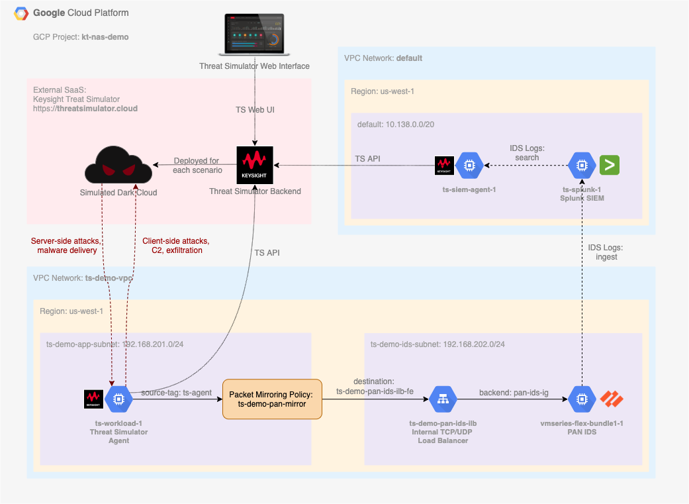

# GCP Cloud IDS Demo with Keysight Threat Simulator

## Overview - TODO CIDS

The demo is targeting a passive network monitoring security tool deployment, operating in [Google Compute Cloud (GCP)](https://cloud.google.com/) environment. It is assumed the tool should be receiving network traffic via [GCP Packet Mirroring](https://cloud.google.com/vpc/docs/packet-mirroring) service. Throughout the demo, a breach and attack simulation software [Keysight Threat Simulator](https://www.keysight.com/us/en/products/network-security/breach-defense/threat-simulator.html) is used to create conditions resembling real malicious activities. The goals of the demo are:

* Validate operational readiness and basic efficacy of a network security moniring tool.
* Compare efficacy of [various tools](https://cloud.google.com/vpc/docs/packet-mirroring-partners) against identical attack scenarious -- as more tools are added to the demo.
* Fine tune configuration of the tool to increace its efficacy.

In this iteration of the demo, a combination of the following security monitoring products is being validated:

* [Palo Alto Networks vm-series firewall](https://console.cloud.google.com/marketplace/product/paloaltonetworksgcp-public/vmseries-flex-bundle1) acting as an [IDS](https://live.paloaltonetworks.com/t5/blogs/vm-series-now-integrates-with-gcp-packet-mirroring/ba-p/302784), and
* [Splunk Enterprise](https://www.splunk.com/en_us/software/splunk-enterprise.html) log data indexing solution acting as a [SIEM](https://en.wikipedia.org/wiki/Security_information_and_event_management).

## Diagram - TODO CIDS



## Adopting command syntax to your environment

1. Throughout the document, a GCP Project ID parameter `--project=kt-nas-demo` is used for `gcloud` command syntax. Please change `kt-nas-demo` to specify a GCP Project ID you intend to use for the deployment
2. Where applicable, GCP Region `us-central1` and/or Zone `us-central1-a` TODO CIDS CHECK ZONE are used withing the document. Consider changing to a region and zone that fit your deployment via `--region=us-central1` and `--zone=us-central1-a` parameters.

## GCP VPC Configuration

1. Create a demo VPC for Threat Simulator agent deployment. If needed, change IP address ranges to fit your design.

| Parameter 						| Value
| --- 									| ---
| Name 									| `ts-demo-vpc`
| Description 					| ThreatSim Demo
| Subnets 							| custom
| &nbsp;&nbsp;&nbsp;&nbsp;Name 								| `ts-demo-app-subnet-us-central1`
| &nbsp;&nbsp;&nbsp;&nbsp;Region 							| us-central1
| &nbsp;&nbsp;&nbsp;&nbsp;&nbsp;&nbsp;&nbsp;&nbsp;IP address range 	| `192.168.211.0/24`

```Shell
gcloud compute networks create ts-demo-vpc --project=kt-nas-demo --description="ThreatSim Demo" --subnet-mode=custom --mtu=1460 --bgp-routing-mode=regional
gcloud compute networks subnets create ts-demo-app-subnet-us-central1 --project=kt-nas-demo --range=192.168.211.0/24 --network=ts-demo-vpc --region=us-central1
```

Cloud IDS service operates via [Private Service Access](https://cloud.google.com/vpc/docs/configure-private-services-access) network connectivity. To start using Cloud IDS, you must enable Private Services Access and allocate an IP address range for private connectivity with Cloud IDS Service Producer. From GCP documentation: "When you create an IDS endpoint, a subnet with a 27-bit mask is allocated from your Private Service Access allocated IP address ranges. The allocated subnet contains an internal load-balancer. Any traffic mirrored or directed to this load-balancer will be inspected by the IDS endpoint."

2. Activate the Service Networking API in your project. The API is required to create a private connection.

```Shell
gcloud services enable servicenetworking.googleapis.com --project=kt-nas-demo
```

3. Allocate an IP range for Google-produced Private Services

```Shell
gcloud compute addresses create google-managed-services-ts-demo-vpc \
    --global \
    --purpose=VPC_PEERING \
    --addresses=172.18.252.0 \
    --prefix-length=22 \
    --description="Peering range for Google Managed Services" \
    --network=ts-demo-vpc \
    --project=kt-nas-demo
```

You can check IP ranges currently allocated using

```Shell
gcloud compute addresses list --global --filter="purpose=VPC_PEERING AND network=ts-demo-vpc"
```

4. Now create a private connection using the IP range

```Shell
gcloud services vpc-peerings connect \
    --service=servicenetworking.googleapis.com \
    --ranges=google-managed-services-ts-demo-vpc \
    --network=ts-demo-vpc \
    --project=kt-nas-demo
```

To check if the operation was successful list existing connections

```Shell
gcloud services vpc-peerings list \
    --network=ts-demo-vpc \
    --project=kt-nas-demo
```

5. Create VPC Firewall rules in `ts-demo-vpc` to permit HTTP and HTTPS traffic to any target tagged as `http-server` and `https-server`, as well as a few additional protocols to any target tagged as 'ts-agent'

```Shell
gcloud compute --project=kt-nas-demo firewall-rules create ts-demo-allow-http --description="Allow http ingress to any instance tagged as http-server" --direction=INGRESS --priority=1000 --network=ts-demo-vpc --action=ALLOW --rules=tcp:80 --source-ranges=0.0.0.0/0 --target-tags=http-server
gcloud compute --project=kt-nas-demo firewall-rules create ts-demo-allow-https --description="Allow https ingress to any instance tagged as https-server" --direction=INGRESS --priority=1000 --network=ts-demo-vpc --action=ALLOW --rules=tcp:443 --source-ranges=0.0.0.0/0 --target-tags=https-server
gcloud compute --project=kt-nas-demo firewall-rules create ts-demo-allow-dcerpc --description="Allow RPC ingress to any instance tagged as ts-agent" --direction=INGRESS --priority=1000 --network=ts-demo-vpc --action=ALLOW --rules=tcp:135 --source-ranges=0.0.0.0/0 --target-tags=ts-agent
gcloud compute --project=kt-nas-demo firewall-rules create ts-demo-allow-smb --description="Allow SMB ingress to any instance tagged as ts-agent" --direction=INGRESS --priority=1000 --network=ts-demo-vpc --action=ALLOW --rules=tcp:445 --source-ranges=0.0.0.0/0 --target-tags=ts-agent
gcloud compute --project=kt-nas-demo firewall-rules create ts-demo-allow-rdp --description="Allow RDP ingress to any instance tagged as ts-agent" --direction=INGRESS --priority=1000 --network=ts-demo-vpc --action=ALLOW --rules=tcp:3389 --source-ranges=0.0.0.0/0 --target-tags=ts-agent
```

6. (Optional) Permit SSH access to GCP instances via a browser. See [https://cloud.google.com/iap/docs/using-tcp-forwarding](https://cloud.google.com/iap/docs/using-tcp-forwarding) for more information.

```Shell
gcloud compute --project=kt-nas-demo firewall-rules create allow-ssh-from-browser-default-vpc --description="https://cloud.google.com/iap/docs/using-tcp-forwarding" --direction=INGRESS --priority=1000 --network=default --action=ALLOW --rules=tcp:22 --source-ranges=35.235.240.0/20
gcloud compute --project=kt-nas-demo firewall-rules create allow-ssh-from-browser-ts-demo-vpc --description="https://cloud.google.com/iap/docs/using-tcp-forwarding" --direction=INGRESS --priority=1000 --network=ts-demo-vpc --action=ALLOW --rules=tcp:22 --source-ranges=35.235.240.0/20
```

## Cloud IDS Endpoint Deployment

1. Create an IDS endpoint under Network Security > CLoud IDS by clicking on “Create Endpoint”

| Parameter 						| Value
| --- 									| ---
| Endpoint name 				| `ts-demo-ids-us-central1`
| Description 					| IDS endpoint for ts-demo-vpc
| Network 							| `ts-demo-vpc`
| Region 								| `us-central1`
| Region 								| `us-central1-a`
| Minimum threat severity alert								| Informational

Click “Create”: This creates the IDS endpoint and this step could take 10-15 mins.

2. Attach a Packet Mirroring policy to this endpoint that will mirror the traffic from the associated VPC and send it to this IDS endpoint.

| Parameter 																										| Value
| ---																														| ---
| Name																													| `ts-demo-ids-mirror`
| Region																												| us-central1
| Policy enforcement																						| Enabled
| Mirrored source - Select with network tags										| `cids-mirror`
| Select mirrored traffic																				| Mirror all traffic

## Threat Simulator Workload Deployment

1. If you do not have an active Threat Simulator account, request evaluation access at [https://threatsimulator.cloud/login](https://threatsimulator.cloud/login)
2. Once the eval is approved, login to [Theat Simulator console](https://threatsimulator.cloud/login), navigate to Deployment page, and open "Anywhere" for a deployment type
3. Scroll down to AGENT INSTALLATION to a CURL command line, which looks similar to the following. In your case, there will be a different `OrganizationID`. Agent version would vary with time as well.

```Shell
curl "https://api.threatsimulator.cloud/agent/download?OrganizationID=1234567890abcdef1234567890abcdef&Type=onpremise-linux" > agent-21.3.0.2325.run
```

4. Copy the 32-character value of `OrganizationID` string from the line above and paste it to the script below on the line `organizationID` right after the `=` sign. Deploy a Threat Simulator Agent instance on GCP by running the following command in GCP Console.

[//]: # (TODO consider making the name of the agent to reflect the instance name.)  

[//]: # (gcloud beta compute instances create ts-workload-1 \)
[//]: # (		--project=kt-nas-demo \)
[//]: # (--network-tier=PREMIUM \)
[//]: # (--maintenance-policy=MIGRATE \)
[//]: # (--reservation-affinity=any \)
[//]: # (--service-account=461244098184-compute@developer.gserviceaccount.com \)
[//]: # (--scopes=https://www.googleapis.com/auth/devstorage.read_only,https://www.googleapis.com/auth/logging.write,https://www.googleapis.com/auth/monitoring.write,https://www.googleapis.com/auth/servicecontrol,https://www.googleapis.com/auth/service.management.readonly,https://www.googleapis.com/auth/trace.append \)
[//]: # (--image=ubuntu-2004-focal-v20210315 \)
[//]: # (--boot-disk-type=pd-balanced \)
[//]: # (--no-shielded-secure-boot \)
[//]: # (--shielded-vtpm \)
[//]: # (--shielded-integrity-monitoring \)

```Shell
gcloud compute instances create ts-demo-workload-usc1a \
--zone=us-central1-a \
--machine-type=e2-small \
--subnet=ts-demo-app-subnet-us-central1 \
--image-family=ubuntu-2004-lts \
--image-project=ubuntu-os-cloud \
--boot-disk-size=10GB \
--boot-disk-device-name=ts-demo-workload-usc1a \
--tags=ts-agent,http-server,https-server,cids-mirror \
--metadata=startup-script='#!/bin/bash -xe
if [ ! -f /home/threatsim/.tsinstalled ]; then
	sysctl -w net.ipv6.conf.all.disable_ipv6=1
	sysctl -w net.ipv6.conf.default.disable_ipv6=1
	apt update
	apt -y install docker.io
	systemctl restart docker
	systemctl enable docker
	useradd -m -G google-sudoers threatsim
	organizationID="1234567890abcdef1234567890abcdef"
	name="GCP-Cloud-IDS-Demo-1"
	APIbaseURL="https://api.threatsimulator.cloud"
	curl $APIbaseURL/agent/download\?OrganizationID\=${organizationID}\&Type\=onpremise-linux >/home/threatsim/agent-init.run
	chown threatsim:threatsim /home/threatsim/agent-init.run
	sudo -u threatsim /bin/bash /home/threatsim/agent-init.run --quiet -- -y -n "${name}"
	if [ `docker ps -qf name=ts-filebeat | wc -l` -ge 1 ]; then touch /home/threatsim/.tsinstalled; fi
fi'
```
		
5. After about 5 minutes the Threat Simulator workload should appear in Threat Simulator UI under [Agents](https://threatsimulator.cloud/security/agent) section


[//]: # (This is enough to run a TS assesment and manually observe threats in GCP Cloud IDS console or Log Explorer)

## Splunk SIEM Deployment

1. Deploy a VM Instance with Ubuntu 20.04 LTS for Splunk Enterprise

```Shell
gcloud beta compute --project=kt-nas-demo instances create ts-default-splunk-usc1a \
--zone=us-central1-a \
--machine-type=n1-standard-16 \
--subnet=default \
--image-family=ubuntu-2004-lts \
--image-project=ubuntu-os-cloud \
--boot-disk-size=100GB \
--boot-disk-device-name=ts-default-splunk-usc1a \
--tags=splunk-server
```

2. Open SSH session and download Splunk Enterprise Deb package

```Shell
wget -O splunk-8.1.3-63079c59e632-linux-2.6-amd64.deb "https://www.splunk.com/bin/splunk/DownloadActivityServlet?architecture=x86_64&platform=linux&version=8.1.3&product=splunk&filename=splunk-8.1.3-63079c59e632-linux-2.6-amd64.deb&wget=true"
```
	
3. Install Splunk, provide admin username and password you would like to use when requested

```Shell
sudo dpkg -i splunk-8.1.3-63079c59e632-linux-2.6-amd64.deb
dpkg --status splunk
cd /opt/splunk/bin
sudo ./splunk start --accept-license
sudo ./splunk enable boot-start
```

4. Allow remote access to API

```Shell
sudo vi /opt/splunk/etc/system/local/server.conf
# +++
[general]
allowRemoteLogin = always
# ---
sudo /opt/splunk/bin/splunk restart
```

5. Permit connection to Splunk services in VPC Firewall by running the following command in GCP Console

```Shell
gcloud compute --project=kt-nas-demo firewall-rules create ts-splunk --description="Access to Splunk instace" --direction=INGRESS --priority=1000 --network=default --action=ALLOW --rules=tcp:8000 --source-ranges=0.0.0.0/0 --target-tags=splunk-server
gcloud compute --project=kt-nas-demo firewall-rules create ts-splunk-syslog --description="Syslog to Splunk instace" --direction=INGRESS --priority=1000 --network=default --action=ALLOW --rules=tcp:5514 --source-tags=ts-siem-agent --target-tags=splunk-server
gcloud compute --project=kt-nas-demo firewall-rules create ts-splunk-api --description="API to Splunk instace" --direction=INGRESS --priority=1000 --network=default --action=ALLOW --rules=tcp:8089 --source-tags=ts-siem-agent --target-tags=splunk-server
```
	
6. Access Splunk Web UI via browser on http port tcp/8000	
	
8. Use SIEM integration guide on https://threatsimulator.cloud/security/settings/siem/siem-deployment-how-to to setup Splunk integration

```
SIEM API Token: xxx
```

Create a SIEM Agent instance

```Shell
gcloud beta compute --project=kt-nas-demo instances create ts-default-siem-agent-ucs1a \
--zone=us-central1-a \
--machine-type=e2-micro \
--subnet=default \
--image-family=ubuntu-2004-lts \
--image-project=ubuntu-os-cloud \
--boot-disk-size=10GB \
--boot-disk-device-name=ts-default-siem-agent-ucs1a \
--tags=ts-siem-agent
```

Download agent

```Shell
sudo su -
apt update
apt -y install docker.io
systemctl restart docker
systemctl enable docker
useradd -m -G google-sudoers threatsim
APIbaseURL="https://api.threatsimulator.cloud"
organizationID="1234567890abcdef1234567890abcdef"
curl $APIbaseURL/agent/download\?OrganizationID\=${organizationID}\&Type\=siem-agent-installer >/home/threatsim/install-siem-agent.sh
chown threatsim:threatsim /home/threatsim/install-siem-agent.sh
sudo -u threatsim /bin/bash /home/threatsim/install-siem-agent.sh
```

9. Follow SIEM CONFIGURATION > SIEM SETUP > SPLUNK SIEM INSTRUCTIONS on https://threatsimulator.cloud/security/settings/siem/siem-deployment-how-to/splunk.

New Data Index
| Parameter 					 | Value
| --- 								 | ---
| Index Name 					 | `threatsim`

New Data Input
| Parameter 					 | Value
| --- 								 | ---
| Input Type 					 | TCP Port
| Port Number 				 | `5514`
| Source name override | N/A
| Restrict to Host 		 | N/A
| Source Type 				 | `threatsim`
| App Context 				 | `TA_threatsimulator`
| Method 							 | IP
| Index 							 | `threatsim`

10. Test Threat Simulator integration with Splunk on https://threatsimulator.cloud/security/settings/siem page.

## Prepare Splunk SIEM for Palo Alto Networks IDS integration

1. Start with Splunk SIEM configuration for Palo Alto Networks IDS. In Splunk Web UI, go to Apps → Find More Apps, type "Palo Alto Networks Add-on for Splunk" in search field. From search results, choose "Palo Alto Networks Add-on for Splunk" and click Install. Once done, click "Go Home".
2. Create index: Go to Settings > Data > Indexes. Select New index and configure the following and Save
	
| Parameter 					 | Value
| --- 								 | ---
| Index name           | `pan`
| App                  | Palo Alto Networks Add-on

3.	Create data input (TCP): Go to Settings > Data > Data inputs. In the Local inputs section, click Add new (from TCP section). Configure:
	
| Parameter 						| Value
| --- 									| ---
| Input Type 						| TCP Port
| Port Number 					| `5614`
| Source name override 	| N/A
| Restrict to Host 			| N/A
| Source Type 					| `pan:log`
| App Context 					| Palo Alto Networks Add-on
| Method 								| IP
| Index 								| `pan`

4. Permit connection to the Splunk Data input service in VPC Firewall by running the following command in GCP Console

```Shell
gcloud compute --project=kt-nas-demo firewall-rules create ts-splunk-syslog-pan --description="PAN Syslog to Splunk instace" --direction=INGRESS --priority=1000 --network=default --action=ALLOW --rules=tcp:5614 --source-tags=pan-security --target-tags=splunk-server
```
	
5. Configure your specific timezone on Splunk instance via SSH

```Shell
sudo su -
cd /opt/splunk/etc/apps/Splunk_TA_paloalto/local
cat >> props.conf << EOF
[pan:log]
TZ = US/Pacific
EOF
/opt/splunk/bin/splunk restart
```

## Palo Alto Networks IDS deployment

0. Prepare VPC configuration for Palo Alto Networks (PAN) firewall deployment 
```Shell
gcloud compute networks subnets create ts-demo-ids-subnet-us-central1 --project=kt-nas-demo --range=192.168.212.0/24 --network=ts-demo-vpc --region=us-central1
```

For successful PAN deployment, we need another VPC to be on "trusted" security zone side on the PAN instance. It will not be used in any other way.

| Parameter 						| Value
| --- 									| ---
| Name 									| `ts-pan-trust-vpc`
| Description 					| ThreatSim Demo - Palo Alto Trusted NIC VPC
| Subnets 							| custom
| &nbsp;&nbsp;&nbsp;&nbsp;Name 								| `ts-pan-trust-subnet-us-central1`
| &nbsp;&nbsp;&nbsp;&nbsp;Region 							| us-central1
| &nbsp;&nbsp;&nbsp;&nbsp;&nbsp;&nbsp;&nbsp;&nbsp;IP address range 	| `192.168.213.0/24`

```Shell
gcloud compute networks create ts-pan-trust-vpc --project=kt-nas-demo --description="ThreatSim Demo - Palo Alto Trusted NIC VPC" --subnet-mode=custom --mtu=1460 --bgp-routing-mode=regional
gcloud compute networks subnets create ts-pan-trust-subnet-us-central1 --project=kt-nas-demo --range=192.168.213.0/24 --network=ts-pan-trust-vpc --region=us-central1
```

1. Deploy PAN IDS instance. GCP Compute instances > Create new > Marketplace: Palo Alto VM-Series Next-Generation Firewall (Bundle1)

| Parameter 																													| Value
| ---																																	| ---
| Deployment name																											| `ts-demo-pan-usc1a`
| Zone																																| us-central1-a
| Machine type																												| 4 vCPUs / 15G RAM
| Interfaces swap																											| Yes (**Do not miss this one!**)
| SSH Key																															| `<admin:ssh-rsa ADD PUBLIC SSH KEY HERE>`
| Networking (VPCs and subnets must be pre-created)
| nic0 - Untrust (IDS) |
| &nbsp;&nbsp;&nbsp;&nbsp;Network																			| `ts-demo-vpc`
| &nbsp;&nbsp;&nbsp;&nbsp;Subnetwork 																	| `ts-demo-ids-subnet-us-central1`
| &nbsp;&nbsp;&nbsp;&nbsp;Enable External IP for Management inteface	| No (*swapped to Untrust*)
| nic1 - Management |
| &nbsp;&nbsp;&nbsp;&nbsp;Network																			| `default`
| &nbsp;&nbsp;&nbsp;&nbsp;Subnetwork																	| `default`
| &nbsp;&nbsp;&nbsp;&nbsp;Enable External IP for Untrust							| Yes (*swapped to Management*)
| nic2 - Trust (not used) |
| &nbsp;&nbsp;&nbsp;&nbsp;Network																			| `ts-pan-trust-vpc`
| &nbsp;&nbsp;&nbsp;&nbsp;Subnetwork																	| `ts-pan-trust-subnet-us-central1`
| &nbsp;&nbsp;&nbsp;&nbsp;Enable External IP for Trust								| No

See https://docs.paloaltonetworks.com/vm-series/9-1/vm-series-deployment/set-up-the-vm-series-firewall-on-google-cloud-platform/prepare-to-set-up-the-vm-series-firewall-on-a-google-instance.html#id1819C02I0AS_id821c495f-3ff8-488d-ab61-28692ab1ce26

2. Edit PAN IDS instance and add Network tags: `pan-security`

4. Permit connection to PAN IDS management in VPC Firewall by running the following command in GCP Console

```Shell
gcloud compute --project=kt-nas-demo firewall-rules create ts-pan-mgmt --description="PAN Management" --direction=INGRESS --priority=1000 --network=default --action=ALLOW --rules=tcp:443,tcp:22 --source-ranges=0.0.0.0/0 --target-tags=pan-security
```
		
5. Connect via SSH to the PAN IDS instance, setup admin password (if you see a password prompt when connecting over SSH, disconnect and wait before connecting again - you should be able connect without a password)

```Shell
ssh -i <ssh_rsa_private_key> admin@<pan_workload_ip_address>
configure
set mgt-config users admin password
commit
```

6. Register the PAN IDS instance on PAN support portal, download and install Dynamic Updates for:

 * Applications and Threats
 * Antivirus

7. Configure PAN as an IDS (outside the scope of this guide)

[//]: # (TODO document this)

8. Configure [Event forwarding from PAN IDS to Splunk](https://knowledgebase.paloaltonetworks.com/KCSArticleDetail?id=kA10g000000ClFfCAK)

[//]: # (TODO DNS resolution fix on PAN)

Syslog Server Profile
| Parameter 				| Value
| ---								| ---
| Name							| `Splunk`
| Server Name				| `ts-default-splunk-usc1a`
| Syslog Server			| <private ip address of ts-default-splunk-usc1a instance>
| Transport					| TCP
| Port							| `5614`
| Format						| BSD
| Facility					| LOG_USER

Log Forwarding Profile
| Parameter 				| Value
| ---								| ---
| Name							| `splunk-log-forwarding`

[//]: # (All types below are needed)

Log Forwarding Profile Match List
| Parameter 				| Value
| ---								| ---
| Name							| `threats`
| Log Type					| `threat`
| Filter						| All Logs
| Syslog						| Splunk
| 									| 
| Name							| `traffic`
| Log Type					| `traffic`
| Filter						| All Logs
| Syslog						| Splunk
| 									| 
| Name							| `wildfire`
| Log Type					| `wildfire`
| Filter						| All Logs
| Syslog						| Splunk
| 									| 
| Name							| `url`
| Log Type					| `url`
| Filter						| All Logs
| Syslog						| Splunk
| 									| 
| Name							| `data`
| Log Type					| `data`
| Filter						| All Logs
| Syslog						| Splunk

Go to Policies > Security Rule. Select the rule for which the log forwarding needs to be applied (IDS Rule). Go to Actions > Log forwarding and select the log forwarding profile from drop down list.
| Parameter 				| Value
| ---								| ---
| Log at Session Start	| Enables
| Log at Session End		| Disabled !!!
| Log Forwarding				| `splunk-log-forwarding`

Commit the changes.

On Dashboard tab, check System Logs to confirm a connection to a syslog server was established: `Syslog connection established to server['AF_INET.<ts-default-splunk-usc1a_ip_address>:5614.']`

// STOPPED HERE

## GCP Packet Mirroring configuration
1. Start with creating an unmanaged GCP Instace Group for Packet Mirroring load balancer backends with PAN IDS monitoring interface:

```Shell
gcloud compute --project=kt-nas-demo instance-groups unmanaged create pan-ids-ig-us-central1-a --zone=us-central1-a --description="PAN IDS group in us-central1-a"
gcloud compute --project=kt-nas-demo instance-groups unmanaged add-instances pan-ids-ig-us-central1-a --zone=us-central1-a --instances=ts-demo-pan-usc1a
```

2. To monitor PAN IDS instance availability, create a Health Check for SSH service and allow connections for this health check in Firewall rules

```Shell
gcloud beta compute health-checks create tcp ssh-health-check \
    --project=kt-nas-demo \
		--port=22 \
		--proxy-header=NONE \
		--no-enable-logging \
		--description="TCP health-check for SSH service" \
		--check-interval=5 \
		--timeout=5 \
		--unhealthy-threshold=2 \
		--healthy-threshold=2

gcloud compute firewall-rules create fw-allow-health-checks \
    --network=ts-demo-vpc \
    --action=ALLOW \
    --direction=INGRESS \
    --source-ranges=35.191.0.0/16,130.211.0.0/22 \
    --target-tags=pan-security \
    --rules=tcp
```

3. Create a backend service for PAN IDS

```Shell
gcloud compute backend-services create ts-demo-pan-ids-us-central1-be \
    --load-balancing-scheme=internal \
    --protocol=tcp \
    --region=us-central1 \
    --health-checks=ssh-health-check
```

4. Add PAN IDS Instance Group to the backend service

```Shell
gcloud compute backend-services add-backend ts-demo-pan-ids-us-central1-be \
    --region=us-central1 \
    --instance-group=pan-ids-ig-us-central1-a \
    --instance-group-zone=us-central1-a
```

5. Create a forwarding rule for the backend service

```Shell
gcloud compute forwarding-rules create ts-demo-pan-ids-ilb-us-central1-fr \
    --region=us-central1 \
    --load-balancing-scheme=internal \
    --network=ts-demo-vpc \
    --subnet=ts-demo-ids-subnet-us-central1 \
    --ip-protocol=TCP \
    --ports=all \
    --backend-service=ts-demo-pan-ids-us-central1-be \
    --backend-service-region=us-central1 \
    --address=192.168.212.4 \
    --is-mirroring-collector
```

6. Create a VPC Packet Mirroring policy

```Shell
gcloud compute packet-mirrorings create ts-demo-pan-mirror-us-central1 \
  --region=us-central1 \
  --network=ts-demo-vpc \
  --mirrored-tags=ts-agent \
  --collector-ilb=ts-demo-pan-ids-ilb-us-central1-fr

gcloud compute packet-mirrorings describe ts-demo-pan-mirror-us-central1 --region=us-central1 
```

All parameters in one table
| Parameter 																										| Value
| ---																														| ---
| Name																													| `ts-demo-pan-mirror-us-central1`
| Region																												| us-central1
| Policy enforcement																						| Enabled
| Mirrored source and destinations are in the same VPC network	| `ts-demo-vpc`
| Mirrored source - Select with network tags										| `ts-agent`
| Mirrored destination																					| Create new L4 internal load balancer
| &nbsp;&nbsp;&nbsp;&nbsp;Name																												| `ts-demo-pan-ids-us-central1-be`
| &nbsp;&nbsp;&nbsp;&nbsp;Backend configuration |
| &nbsp;&nbsp;&nbsp;&nbsp;&nbsp;&nbsp;&nbsp;&nbsp;Region																										| us-central1
| &nbsp;&nbsp;&nbsp;&nbsp;&nbsp;&nbsp;&nbsp;&nbsp;Network																										| `ts-demo-vpc`
| &nbsp;&nbsp;&nbsp;&nbsp;&nbsp;&nbsp;&nbsp;&nbsp;Backends instance Group																		| `pan-ids-ig`
| &nbsp;&nbsp;&nbsp;&nbsp;&nbsp;&nbsp;&nbsp;&nbsp;Health check																							| `ssh-health-check`
| &nbsp;&nbsp;&nbsp;&nbsp;Frontend configuration |
| &nbsp;&nbsp;&nbsp;&nbsp;&nbsp;&nbsp;&nbsp;&nbsp;Name																											| `ts-demo-pan-ids-ilb-us-central1-fr`
| &nbsp;&nbsp;&nbsp;&nbsp;&nbsp;&nbsp;&nbsp;&nbsp;Subnetwork																								| `ts-demo-ids-subnet-us-central1`
| &nbsp;&nbsp;&nbsp;&nbsp;&nbsp;&nbsp;&nbsp;&nbsp;Internal IP |
| &nbsp;&nbsp;&nbsp;&nbsp;&nbsp;&nbsp;&nbsp;&nbsp;&nbsp;&nbsp;&nbsp;&nbsp;Purpose														| Non-shared
| &nbsp;&nbsp;&nbsp;&nbsp;&nbsp;&nbsp;&nbsp;&nbsp;&nbsp;&nbsp;&nbsp;&nbsp;IP address												| Static internal IP address
| &nbsp;&nbsp;&nbsp;&nbsp;&nbsp;&nbsp;&nbsp;&nbsp;&nbsp;&nbsp;&nbsp;&nbsp;&nbsp;&nbsp;&nbsp;&nbsp;Address		| `192.168.212.4`
| &nbsp;&nbsp;&nbsp;&nbsp;&nbsp;&nbsp;&nbsp;&nbsp;Global access																							| Disable
| &nbsp;&nbsp;&nbsp;&nbsp;&nbsp;&nbsp;&nbsp;&nbsp;Packet mirroring (advanced configuration)									| Enable this load balancer for Packet Mirroring
| Collector destination																					| `ts-demo-pan-ids-ilb-us-central1-fr`
| Select mirrored traffic																				| Mirror all traffic

4. Create firewall rules to permit mirrored traffic

Egress from source instances. Use an IP address assiged as a Frontend Internal IP in the previous step as `--destination-ranges`.

```Shell
gcloud compute --project=kt-nas-demo firewall-rules create ts-demo-packet-mirror-egress-pan-ids-ilb-us-central1-fr --description="Packet mirroring egress from sources to PAN" --direction=EGRESS --priority=1000 --network=ts-demo-vpc --action=ALLOW --rules=all --destination-ranges=192.168.212.4/32
```

Ingress to PAN IDS
	
```Shell
gcloud compute --project=kt-nas-demo firewall-rules create ts-demo-packet-mirror-pan --description="Packet mirrirong ingress traffic to PAN IDS" --direction=INGRESS --priority=1000 --network=ts-demo-vpc --action=ALLOW --rules=all --source-ranges=0.0.0.0/0 --target-tags=pan-security
```

4. In PAN IDS configuration, add a loopback.1 interface with an IP address assiged as a Frontend Internal IP in the previous step. Add loopback.1 to a virtual router configuration. Create static routes for the following health-check IP address ranges: `35.191.0.0/16,130.211.0.0/22` pointing to a default gateway in the subnet of `Ethenet1/1` interface: `192.168.212.1`

