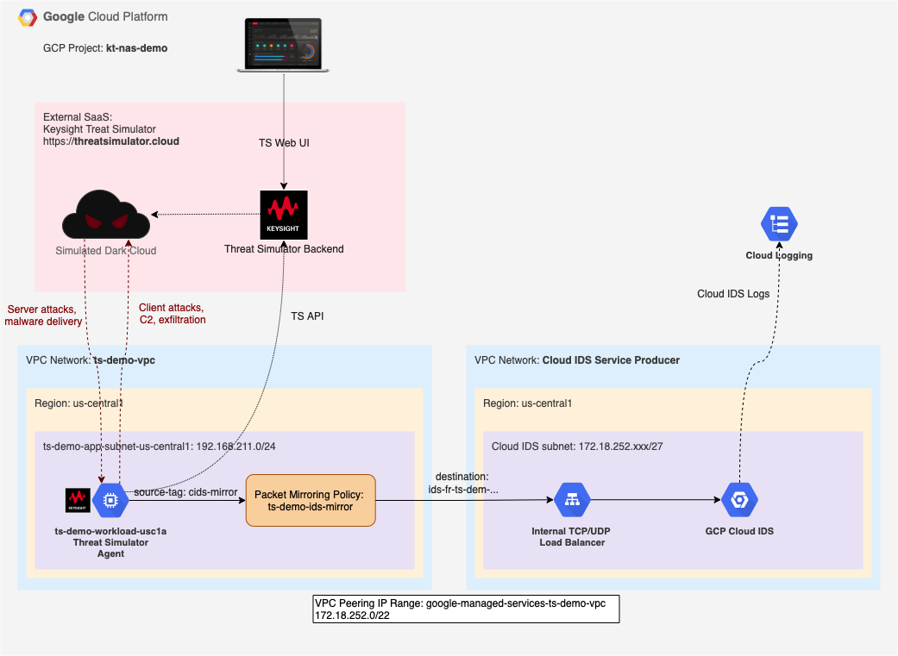
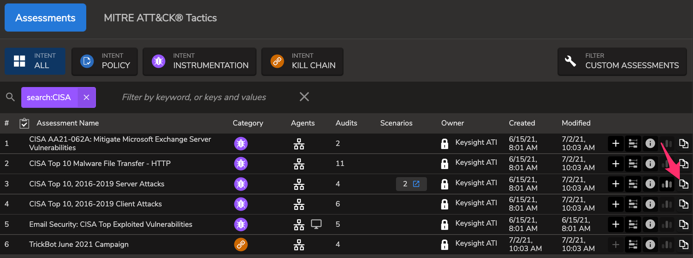
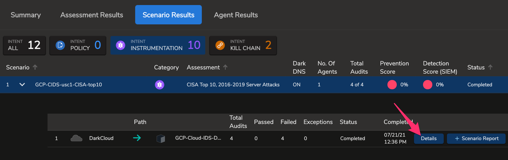
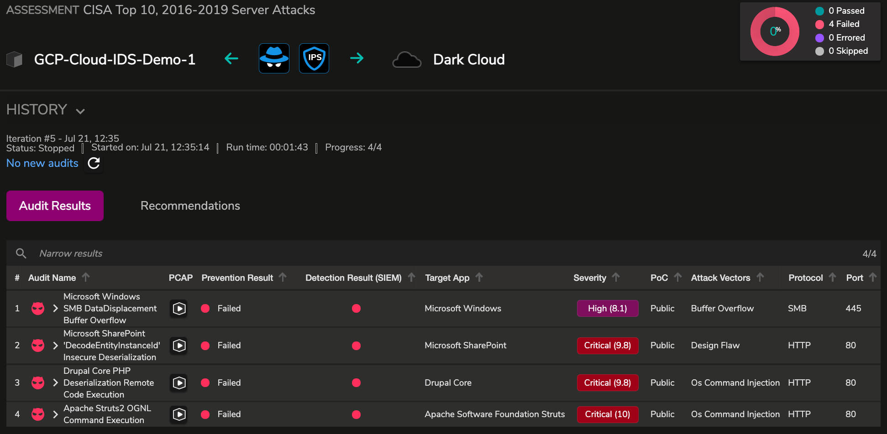

# GCP Cloud IDS Demo with Keysight Threat Simulator

## Overview

The demo is targeting a passive network detection and response (NDR) scenario with [Cloud IDS](https://cloud.google.com/ids) service in [Google Compute Cloud (GCP)](https://cloud.google.com/) environment. Throughout the demo, a breach and attack simulation software [Keysight Threat Simulator](https://www.keysight.com/us/en/products/network-security/breach-defense/threat-simulator.html) is used to create conditions resembling real malicious activities. The goals of the demo are:

* Demonstrate Cloud IDS capabilities in detecting threats.
* Create a sandbox environment for evaluate efficacy of Cloud IDS against various attack scenarious.
* Provide a framework for monitoring operational readiness and basic efficacy of Cloud IDS in your environment.
* Fascilitate integration efforts to ingest and process Cloud IDS alerts by downstream SIEM tools.

## Diagram



## Adopting command syntax to your environment

1. Throughout the document, a GCP Project ID parameter `--project=kt-nas-demo` is used for `gcloud` command syntax. Please change `kt-nas-demo` to specify a GCP Project ID you intend to use for the deployment
2. Where applicable, GCP Region `us-central1` and/or Zone `us-central1-a` TODO CIDS CHECK ZONE are used withing the document. Consider changing to a region and zone that fit your deployment via `--region=us-central1` and `--zone=us-central1-a` parameters.

## GCP VPC Configuration

1. Create a demo VPC for Threat Simulator agent deployment. If needed, change IP address ranges to fit your design.

| Parameter 						| Value
| --- 									| ---
| Name 									| `ts-demo-vpc`
| Description 					| ThreatSim Demo
| Subnets 							| custom
| &nbsp;&nbsp;&nbsp;&nbsp;Name 								| `ts-demo-app-subnet-us-central1`
| &nbsp;&nbsp;&nbsp;&nbsp;Region 							| us-central1
| &nbsp;&nbsp;&nbsp;&nbsp;&nbsp;&nbsp;&nbsp;&nbsp;IP address range 	| `192.168.211.0/24`

```Shell
gcloud compute networks create ts-demo-vpc --project=kt-nas-demo --description="ThreatSim Demo" --subnet-mode=custom --mtu=1460 --bgp-routing-mode=regional
gcloud compute networks subnets create ts-demo-app-subnet-us-central1 --project=kt-nas-demo --range=192.168.211.0/24 --network=ts-demo-vpc --region=us-central1
```

Cloud IDS service operates via [Private Service Access](https://cloud.google.com/vpc/docs/configure-private-services-access) network connectivity. To start using Cloud IDS, you must enable Private Services Access and allocate an IP address range for private connectivity with Cloud IDS Service Producer. From GCP documentation: "When you create an IDS endpoint, a subnet with a 27-bit mask is allocated from your Private Service Access allocated IP address ranges. The allocated subnet contains an internal load-balancer. Any traffic mirrored or directed to this load-balancer will be inspected by the IDS endpoint."

2. Activate the Service Networking API in your project. The API is required to create a private connection.

```Shell
gcloud services enable servicenetworking.googleapis.com --project=kt-nas-demo
```

3. Allocate an IP range for Google-produced Private Services

```Shell
gcloud compute addresses create google-managed-services-ts-demo-vpc \
    --global \
    --purpose=VPC_PEERING \
    --addresses=172.18.252.0 \
    --prefix-length=22 \
    --description="Peering range for Google Managed Services" \
    --network=ts-demo-vpc \
    --project=kt-nas-demo
```

You can check IP ranges currently allocated using

```Shell
gcloud compute addresses list --global --filter="purpose=VPC_PEERING AND network=ts-demo-vpc"
```

4. Now create a private connection using the IP range

```Shell
gcloud services vpc-peerings connect \
    --service=servicenetworking.googleapis.com \
    --ranges=google-managed-services-ts-demo-vpc \
    --network=ts-demo-vpc \
    --project=kt-nas-demo
```

To check if the operation was successful list existing connections

```Shell
gcloud services vpc-peerings list \
    --network=ts-demo-vpc \
    --project=kt-nas-demo
```

5. Create VPC Firewall rules in `ts-demo-vpc` to permit HTTP and HTTPS traffic to any target tagged as `http-server` and `https-server`, as well as a few additional protocols to any target tagged as 'ts-agent'

```Shell
gcloud compute --project=kt-nas-demo firewall-rules create ts-demo-allow-http --description="Allow http ingress to any instance tagged as http-server" --direction=INGRESS --priority=1000 --network=ts-demo-vpc --action=ALLOW --rules=tcp:80 --source-ranges=0.0.0.0/0 --target-tags=http-server
gcloud compute --project=kt-nas-demo firewall-rules create ts-demo-allow-https --description="Allow https ingress to any instance tagged as https-server" --direction=INGRESS --priority=1000 --network=ts-demo-vpc --action=ALLOW --rules=tcp:443 --source-ranges=0.0.0.0/0 --target-tags=https-server
gcloud compute --project=kt-nas-demo firewall-rules create ts-demo-allow-dcerpc --description="Allow RPC ingress to any instance tagged as ts-agent" --direction=INGRESS --priority=1000 --network=ts-demo-vpc --action=ALLOW --rules=tcp:135 --source-ranges=0.0.0.0/0 --target-tags=ts-agent
gcloud compute --project=kt-nas-demo firewall-rules create ts-demo-allow-smb --description="Allow SMB ingress to any instance tagged as ts-agent" --direction=INGRESS --priority=1000 --network=ts-demo-vpc --action=ALLOW --rules=tcp:445 --source-ranges=0.0.0.0/0 --target-tags=ts-agent
gcloud compute --project=kt-nas-demo firewall-rules create ts-demo-allow-rdp --description="Allow RDP ingress to any instance tagged as ts-agent" --direction=INGRESS --priority=1000 --network=ts-demo-vpc --action=ALLOW --rules=tcp:3389 --source-ranges=0.0.0.0/0 --target-tags=ts-agent
```

6. (Optional) Permit SSH access to GCP instances via a browser. See [https://cloud.google.com/iap/docs/using-tcp-forwarding](https://cloud.google.com/iap/docs/using-tcp-forwarding) for more information.

```Shell
gcloud compute --project=kt-nas-demo firewall-rules create allow-ssh-from-browser-default-vpc --description="https://cloud.google.com/iap/docs/using-tcp-forwarding" --direction=INGRESS --priority=1000 --network=default --action=ALLOW --rules=tcp:22 --source-ranges=35.235.240.0/20
gcloud compute --project=kt-nas-demo firewall-rules create allow-ssh-from-browser-ts-demo-vpc --description="https://cloud.google.com/iap/docs/using-tcp-forwarding" --direction=INGRESS --priority=1000 --network=ts-demo-vpc --action=ALLOW --rules=tcp:22 --source-ranges=35.235.240.0/20
```

## Cloud IDS Endpoint Deployment

1. Create an IDS endpoint under Network Security > CLoud IDS by clicking on “Create Endpoint”

| Parameter 						| Value
| --- 									| ---
| Endpoint name 				| `ts-demo-ids-us-central1`
| Description 					| IDS endpoint for ts-demo-vpc
| Network 							| `ts-demo-vpc`
| Region 								| `us-central1`
| Region 								| `us-central1-a`
| Minimum threat severity alert								| Informational

Click “Create”: This creates the IDS endpoint and this step could take 10-15 mins.

2. Attach a Packet Mirroring policy to this endpoint that will mirror the traffic from the associated VPC and send it to this IDS endpoint.

| Parameter 																										| Value
| ---																														| ---
| Name																													| `ts-demo-ids-mirror`
| Region																												| us-central1
| Policy enforcement																						| Enabled
| Mirrored source - Select with network tags										| `cids-mirror`
| Select mirrored traffic																				| Mirror all traffic

## Threat Simulator Workload Deployment

1. If you do not have an active Threat Simulator account, request evaluation access at [https://threatsimulator.cloud/login](https://threatsimulator.cloud/login)
2. Once the eval is approved, login to [Theat Simulator console](https://threatsimulator.cloud/login), navigate to Deployment page, and open "Anywhere" for a deployment type
3. Scroll down to AGENT INSTALLATION to a CURL command line, which looks similar to the following. In your case, there will be a different `OrganizationID`. Agent version would vary with time as well.

```Shell
curl "https://api.threatsimulator.cloud/agent/download?OrganizationID=1234567890abcdef1234567890abcdef&Type=onpremise-linux" > agent-21.3.0.2325.run
```

4. Copy the 32-character value of `OrganizationID` string from the line above and paste it to the script below on the line `organizationID` right after the `=` sign. Deploy a Threat Simulator Agent instance on GCP by running the following command in GCP Console.

[//]: # (TODO consider making the name of the agent to reflect the instance name.)  

[//]: # (gcloud beta compute instances create ts-workload-1 \)
[//]: # (		--project=kt-nas-demo \)
[//]: # (--network-tier=PREMIUM \)
[//]: # (--maintenance-policy=MIGRATE \)
[//]: # (--reservation-affinity=any \)
[//]: # (--service-account=461244098184-compute@developer.gserviceaccount.com \)
[//]: # (--scopes=https://www.googleapis.com/auth/devstorage.read_only,https://www.googleapis.com/auth/logging.write,https://www.googleapis.com/auth/monitoring.write,https://www.googleapis.com/auth/servicecontrol,https://www.googleapis.com/auth/service.management.readonly,https://www.googleapis.com/auth/trace.append \)
[//]: # (--image=ubuntu-2004-focal-v20210315 \)
[//]: # (--boot-disk-type=pd-balanced \)
[//]: # (--no-shielded-secure-boot \)
[//]: # (--shielded-vtpm \)
[//]: # (--shielded-integrity-monitoring \)

```Shell
gcloud compute instances create ts-demo-workload-usc1a \
--zone=us-central1-a \
--machine-type=e2-small \
--subnet=ts-demo-app-subnet-us-central1 \
--image-family=ubuntu-2004-lts \
--image-project=ubuntu-os-cloud \
--boot-disk-size=10GB \
--boot-disk-device-name=ts-demo-workload-usc1a \
--tags=ts-agent,http-server,https-server,cids-mirror \
--metadata=startup-script='#!/bin/bash -xe
if [ ! -f /home/threatsim/.tsinstalled ]; then
	sysctl -w net.ipv6.conf.all.disable_ipv6=1
	sysctl -w net.ipv6.conf.default.disable_ipv6=1
	apt update
	apt -y install docker.io
	systemctl restart docker
	systemctl enable docker
	useradd -m -G google-sudoers threatsim
	organizationID="1234567890abcdef1234567890abcdef"
	name="GCP-Cloud-IDS-Demo-1"
	APIbaseURL="https://api.threatsimulator.cloud"
	curl $APIbaseURL/agent/download\?OrganizationID\=${organizationID}\&Type\=onpremise-linux >/home/threatsim/agent-init.run
	chown threatsim:threatsim /home/threatsim/agent-init.run
	sudo -u threatsim /bin/bash /home/threatsim/agent-init.run --quiet -- -y -n "${name}"
	if [ `docker ps -qf name=ts-filebeat | wc -l` -ge 1 ]; then touch /home/threatsim/.tsinstalled; fi
fi'
```
		
5. After about 5 minutes the Threat Simulator workload should appear in Threat Simulator UI under [Agents](https://threatsimulator.cloud/security/agent) section

## Simulate Malitious Activity

1. Login to Threat Simulator web interface [https://threatsimulator.cloud/](https://threatsimulator.cloud/)
2. Navigate to Assesment tab, enter "CISA" in assesment fiter
3. Locate an assesment named "CISA Top 10, 2016-2019 Server Attacks", and launch a new scenario form from it:



4. On the Create Scenario form, for Step 2, select a Threat Simulator agent you previously deployed as "GCP-Cloud-IDS-Demo-1"
5. Click Advanced and change a protocol from default HTTPS to HTTP (port 80)
6. Name the scenario as "GCP-Cloud-IDS-CISA-Top10-Server" and click "Add and Run Scenario"
7. As the scenario is being executed, monitor Cloud IDS alarms and compare them with audits executed by Threat Simulator on Dashboard tab:






