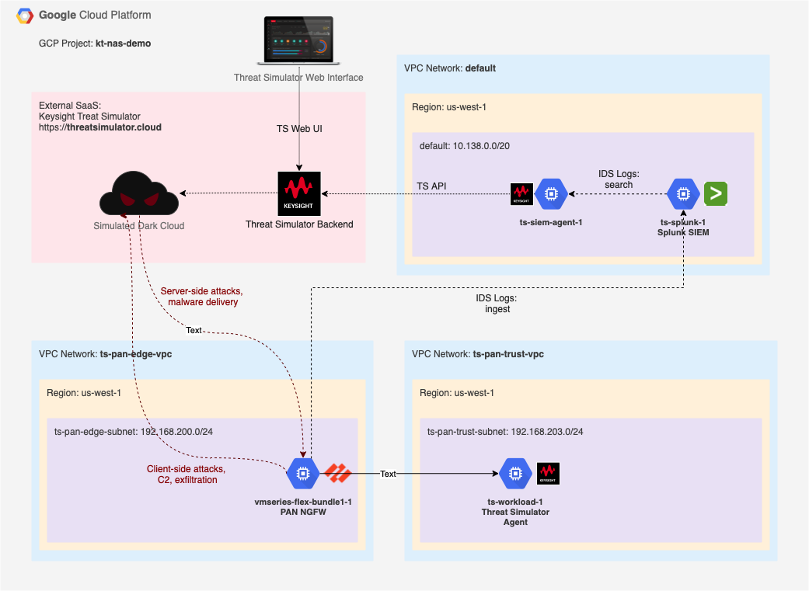

# Google Cloud Network Security Demo - Palo Alto Networks Firewall

## Overview

The demo is targeting Palo Alto next generation firewall deployment operating in [Google Compute Cloud (GCP)](https://cloud.google.com/) environment. Throughout the demo, a breach and attack simulation software [Keysight Threat Simulator](https://www.keysight.com/us/en/products/network-security/breach-defense/threat-simulator.html) is used to create conditions resembling real malicious activities. The goals of the demo are:

* Validate operational readiness and basic efficacy of PAN Next Gen firewall.
* Fine tune configuration of the firewall to increase its efficacy.

In this iteration of the demo, a combination of the following security monitoring products is being validated:

* [Palo Alto Networks vm-series firewall](https://console.cloud.google.com/marketplace/product/paloaltonetworksgcp-public/vmseries-flex-bundle1), and
* [Splunk Enterprise](https://www.splunk.com/en_us/software/splunk-enterprise.html) log data indexing solution acting as a [SIEM](https://en.wikipedia.org/wiki/Security_information_and_event_management).

## Diagram



## Adopting command syntax to your environment

1. Throughout the document, a GCP Project ID parameter `--project=kt-nas-demo` is used for `gcloud` command syntax. Please change `kt-nas-demo` to specify a GCP Project ID you intend to use for the deployment
2. Where applicable, GCP Region `us-west1` (Oregon) and/or Zone `us-west1-b` are used withing the document. Consider changing to a region and zone that fit your deployment via `--region=us-west1` and `--zone=us-west1-b` parameters.

## GCP VPC Configuration

1. Create two VPCs for
	* PAN untrusted zone: `ts-pan-edge-vpc`, internet-facing,
	* PAN trusted zone: `ts-pan-trust-vpc`, Threat Simulator agent deployment.
	
	If needed, change IP address ranges to fit your design.

| Parameter 						| Value
| --- 									| ---
| Name 									| `ts-pan-edge-vpc`
| Description 					| ThreatSim Demo - PAN Untrusted NIC VPC
| Subnets 							| custom
| &nbsp;&nbsp;&nbsp;&nbsp;Name 								| `ts-pan-edge-subnet`
| &nbsp;&nbsp;&nbsp;&nbsp;Region 							| us-west1
| &nbsp;&nbsp;&nbsp;&nbsp;&nbsp;&nbsp;&nbsp;&nbsp;IP address range 	| `192.168.200.0/24`

```Shell
gcloud compute networks create ts-pan-edge-vpc --project=kt-nas-demo --description="ThreatSim Demo - PAN Untrusted NIC VPC" --subnet-mode=custom --mtu=1460 --bgp-routing-mode=regional
gcloud compute networks subnets create ts-pan-edge-subnet --project=kt-nas-demo --range=192.168.200.0/24 --network=ts-pan-edge-vpc --region=us-west1
```

| Parameter 						| Value
| --- 									| ---
| Name 									| `ts-pan-trust-vpc`
| Description 					| ThreatSim Demo - PAN Trusted NIC VPC
| Subnets 							| custom
| &nbsp;&nbsp;&nbsp;&nbsp;Name 								| `ts-pan-trust-subnet`
| &nbsp;&nbsp;&nbsp;&nbsp;Region 							| us-west1
| &nbsp;&nbsp;&nbsp;&nbsp;&nbsp;&nbsp;&nbsp;&nbsp;IP address range 	| `192.168.203.0/24`

```Shell
gcloud compute networks create ts-pan-trust-vpc --project=kt-nas-demo --description="ThreatSim Demo - PAN Trusted NIC VPC" --subnet-mode=custom --mtu=1460 --bgp-routing-mode=regional
gcloud compute networks subnets create ts-pan-trust-subnet --project=kt-nas-demo --range=192.168.203.0/24 --network=ts-pan-trust-vpc --region=us-west1
```

2. Create VPC Firewall rules in `ts-pan-edge-vpc` and `ts-pan-trust-vpc` to permit any traffic to and from PAN instances tagged as `pan-ngfw`

```Shell
gcloud compute --project=kt-nas-demo firewall-rules create ts-pan-edge-allow-ngfw-any-ingress --description="Allow any traffic to instances tagged as pan-ngfw" --direction=INGRESS --priority=1000 --network=ts-pan-edge-vpc --action=ALLOW --rules=all --source-ranges=0.0.0.0/0 --target-tags=pan-ngfw
gcloud compute --project=kt-nas-demo firewall-rules create ts-pan-edge-allow-ngfw-any-egress --description="Allow any traffic from instances tagged as pan-ngfw" --direction=EGRESS --priority=1000 --network=ts-pan-edge-vpc --action=ALLOW --rules=all --destination-ranges=0.0.0.0/0 --target-tags=pan-ngfw
```

```Shell
gcloud compute --project=kt-nas-demo firewall-rules create ts-pan-trust-allow-ngfw-any-ingress --description="Allow any traffic to instances tagged as pan-ngfw" --direction=INGRESS --priority=1000 --network=ts-pan-trust-vpc --action=ALLOW --rules=all --source-ranges=0.0.0.0/0 --target-tags=pan-ngfw
gcloud compute --project=kt-nas-demo firewall-rules create ts-pan-trust-allow-ngfw-any-egress --description="Allow any traffic from instances tagged as pan-ngfw" --direction=EGRESS --priority=1000 --network=ts-pan-trust-vpc --action=ALLOW --rules=all --destination-ranges=0.0.0.0/0 --target-tags=pan-ngfw
```

3. Create VPC Firewall rules in `ts-pan-trust-vpc` to permit any egress connections from any instances tagged as `ts-agent` - TreatSim agents

```Shell
gcloud compute --project=kt-nas-demo firewall-rules create ts-pan-trust-allow-ts-agent-any-egress --description="Allow any traffic from instances tagged as ts-agent" --direction=EGRESS --priority=1000 --network=ts-pan-trust-vpc --action=ALLOW --rules=all --destination-ranges=0.0.0.0/0 --target-tags=ts-agent
```


3. Create VPC Firewall rules in `ts-pan-trust-vpc` to permit HTTP and HTTPS traffic to any target tagged as `http-server` and `https-server`

```Shell
gcloud compute --project=kt-nas-demo firewall-rules create ts-demo-allow-http --description="Allow http ingress to any instance tagged as http-server" --direction=INGRESS --priority=1000 --network=ts-demo-vpc --action=ALLOW --rules=tcp:80 --source-ranges=0.0.0.0/0 --target-tags=http-server
gcloud compute --project=kt-nas-demo firewall-rules create ts-demo-allow-https --description="Allow https ingress to any instance tagged as https-server" --direction=INGRESS --priority=1000 --network=ts-demo-vpc --action=ALLOW --rules=tcp:443 --source-ranges=0.0.0.0/0 --target-tags=https-server
```


3. (Optional) Permit SSH access to GCP instances via a browser. See [https://cloud.google.com/iap/docs/using-tcp-forwarding](https://cloud.google.com/iap/docs/using-tcp-forwarding) for more information.

```Shell
gcloud compute --project=kt-nas-demo firewall-rules create allow-ssh-from-browser-default-vpc --description="https://cloud.google.com/iap/docs/using-tcp-forwarding" --direction=INGRESS --priority=1000 --network=default --action=ALLOW --rules=tcp:22 --source-ranges=35.235.240.0/20
gcloud compute --project=kt-nas-demo firewall-rules create allow-ssh-from-browser-ts-pan-trust-vpc --description="https://cloud.google.com/iap/docs/using-tcp-forwarding" --direction=INGRESS --priority=1000 --network=ts-pan-trust-vpc --action=ALLOW --rules=tcp:22 --source-ranges=35.235.240.0/20
```

## Palo Alto Networks NGFW deployment

1. Deploy PAN NGFW instance. GCP Compute instances > Create new > Marketplace: Palo Alto VM-Series Next-Generation Firewall (Bundle1)

| Parameter 																													| Value
| ---																																	| ---
| Deployment name																											| `ts-demo-pan-ngfw-usw1b`
| Zone																																| us-west1-b
| Machine type																												| 4 vCPUs / 15G RAM
| Interfaces swap																											| No
| SSH Key																															| `<admin:ssh-rsa ADD PUBLIC SSH KEY HERE>`
| Networking (VPCs and subnets must be pre-created)
| nic0 - Management |
| &nbsp;&nbsp;&nbsp;&nbsp;Network																			| `default`
| &nbsp;&nbsp;&nbsp;&nbsp;Subnetwork																	| `default`
| &nbsp;&nbsp;&nbsp;&nbsp;Enable External IP for Management inteface	| Yes 
| nic1 - Untrust |
| &nbsp;&nbsp;&nbsp;&nbsp;Network																			| `ts-pan-edge-vpc`
| &nbsp;&nbsp;&nbsp;&nbsp;Subnetwork 																	| `ts-pan-edge-subnet`
| &nbsp;&nbsp;&nbsp;&nbsp;Enable External IP for Untrust							| Yes
| nic2 - Trust |
| &nbsp;&nbsp;&nbsp;&nbsp;Network																			| `ts-pan-trust-vpc`
| &nbsp;&nbsp;&nbsp;&nbsp;Subnetwork																	| `ts-pan-trust-subnet`
| &nbsp;&nbsp;&nbsp;&nbsp;Enable External IP for Trust								| No

See https://docs.paloaltonetworks.com/vm-series/9-1/vm-series-deployment/set-up-the-vm-series-firewall-on-google-cloud-platform/prepare-to-set-up-the-vm-series-firewall-on-a-google-instance.html#id1819C02I0AS_id821c495f-3ff8-488d-ab61-28692ab1ce26

2. Edit PAN IDS instance and add Network tags: `pan-ngfw`

3. Permit connection to PAN management NIC in VPC Firewall by running the following command in GCP Console

```Shell
gcloud compute --project=kt-nas-demo firewall-rules create ts-pan-ngfw-mgmt --description="PAN Management" --direction=INGRESS --priority=1000 --network=default --action=ALLOW --rules=tcp:443,tcp:22 --source-ranges=0.0.0.0/0 --target-tags=pan-ngfw
```

4. Connect via SSH to the PAN instance, setup admin password (if you see a password prompt when connecting over SSH, disconnect and wait before connecting again - you should be able connect without a password)

```Shell
ssh -i <ssh_rsa_private_key> admin@<pan_workload_ip_address>
configure
set mgt-config users admin password
commit
```

5. Connect to PAN instance public IP via a browser, login as an admin. You'll information displayed on Dashboard under General Information to register the instance on the next step

6. Register the PAN IDS instance on [PAN support portal](https://support.paloaltonetworks.com/) under Assets/Devices

7. Via PAN management UI, download and install Dynamic Updates for Applications and Threats: Device / Dynamic Updates

8. Configure PAN as an NGFW 

	* Network interfaces as DHCP - Trust, Untrust; Untrust has default route. Apply Ping-only management profile
	* NAT - Source NAT from Trust to Untrust using Untrust interfaces as Dynamic IP and Port
	* Security - Trust-2-Untrust rule to permit any traffic from Trust to Untrust. Make sure to Log at Session End

[//]: # (TODO provide an XML configuration for the demo)

9. Configure Event forwarding from PAN IDS to Splunk (outside the scope of this guide)

[//]: # (TODO document this)


9. Create a default route on `ts-pan-trust-vpc` via `ts-demo-pan-ngfw-usw1b` instance

```Shell
gcloud beta compute routes create ts-pan-trust-default --project=kt-nas-demo --description="Default route from PAN Trust VPC via PAN NGFW" --network=ts-pan-trust-vpc --priority=1000 --destination-range=0.0.0.0/0 --next-hop-instance=ts-demo-pan-ngfw-usw1b --next-hop-instance-zone=us-west1-b
```


## Threat Simulator Workload Deployment

1. If you do not have an active Threat Simulator account, request evaluation access at [https://threatsimulator.cloud/login](https://threatsimulator.cloud/login)
2. Once the eval is approved, login to [Theat Simulator console](https://threatsimulator.cloud/login), navigate to Deployment page, and open "Anywhere" for a deployment type
3. Scroll down to AGENT INSTALLATION to a CURL command line, which looks similar to the following. In your case, there will be a different `OrganizationID`. Agent version would vary with time as well.

```Shell
curl "https://api.threatsimulator.cloud/agent/download?OrganizationID=1234567890abcdef1234567890abcdef&Type=onpremise-linux" > agent-21.3.0.2325.run
```

4. Copy the 32-character value of `OrganizationID` string from the line above and paste it to the script below on the line `organizationID` right after the `=` sign. Deploy a Threat Simulator Agent instance on GCP by running the following command in GCP Console.

[//]: # (TODO consider making the name of the agent to reflect the instance name.)  

[//]: # (gcloud beta compute instances create ts-workload-1 \)
[//]: # (		--project=kt-nas-demo \)
[//]: # (--network-tier=PREMIUM \)
[//]: # (--maintenance-policy=MIGRATE \)
[//]: # (--reservation-affinity=any \)
[//]: # (--service-account=461244098184-compute@developer.gserviceaccount.com \)
[//]: # (--scopes=https://www.googleapis.com/auth/devstorage.read_only,https://www.googleapis.com/auth/logging.write,https://www.googleapis.com/auth/monitoring.write,https://www.googleapis.com/auth/servicecontrol,https://www.googleapis.com/auth/service.management.readonly,https://www.googleapis.com/auth/trace.append \)
[//]: # (--image=ubuntu-2004-focal-v20210315 \)
[//]: # (--boot-disk-type=pd-balanced \)
[//]: # (--no-shielded-secure-boot \)
[//]: # (--shielded-vtpm \)
[//]: # (--shielded-integrity-monitoring \)

```Shell
gcloud compute instances create ts-workload-behind-pan-1 \
--zone=us-west1-b \
--machine-type=e2-small \
--subnet=ts-pan-trust-subnet \
--no-address \
--image-family=ubuntu-2004-lts \
--image-project=ubuntu-os-cloud \
--boot-disk-size=10GB \
--boot-disk-device-name=ts-workload-behind-pan-1 \
--tags=ts-agent,http-server,https-server \
--metadata=startup-script='#!/bin/bash -xe
if [ ! -f /home/threatsim/.tsinstalled ]; then
	sysctl -w net.ipv6.conf.all.disable_ipv6=1
	sysctl -w net.ipv6.conf.default.disable_ipv6=1
	apt update
	apt -y install docker.io
	systemctl restart docker
	systemctl enable docker
	useradd -m -G google-sudoers threatsim
	organizationID="1234567890abcdef1234567890abcdef"
	name="GCP-PAN-NGFW-Demo-1"
	APIbaseURL="https://api.threatsimulator.cloud"
	curl $APIbaseURL/agent/download\?OrganizationID\=${organizationID}\&Type\=onpremise-linux >/home/threatsim/agent-init.run
	chown threatsim:threatsim /home/threatsim/agent-init.run
	sudo -u threatsim /bin/bash /home/threatsim/agent-init.run --quiet -- -y -n "${name}"
	if [ `docker ps -qf name=ts-filebeat | wc -l` -ge 1 ]; then touch /home/threatsim/.tsinstalled; fi
fi'
```
		
5. After about 5 minutes the Threat Simulator workload should appear in Threat Simulator UI under [Agents](https://threatsimulator.cloud/security/agent) section

## Splunk SIEM Deployment

TBD

## Prepare Splunk SIEM for Palo Alto Networks IDS integration

TBD
